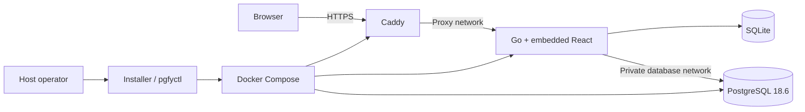

# Pgfy

A self-hosted PostgreSQL foundation for small projects: your server, your data, one administrator.

The intended MVP lets you install one release on a compatible VPS and configure an existing S3-compatible backup bucket in Settings. Compute
and storage are independent choices; neither requires an AWS account. The initial portability validation is part of the MVP, with targets
and pending evidence listed in [the validation document](docs/phase1-validation.md#portability-validation-targets).

The implementation is a Go application with an embedded React dashboard, SQLite management state, PostgreSQL 18.6, and Caddy.

## Implemented

- One-command install with HTTPS-first dashboard access, single-admin setup, sessions, CSRF, rate limits.
- Projects: one name creates a database, a restricted role and a strong password; resumable provisioning with honest failure states and retry.
- Connection details with `sslmode=verify-full`, driver snippets, an SSH-tunnel path, and an observed connection check from the application environment.
- Database TLS with the dashboard certificate delivered to PostgreSQL by `pgfyctl sync-db-cert` (daily timer); per-project allowed-address rules applied and verified through PostgreSQL's own parser and reload; TLS-only remote access; cross-project isolation.
- Backups to any S3-compatible bucket configured in Settings: storage check, manual and daily backups, manifests published last, durable one-at-a-time jobs that survive browser closure and report restarts as interrupted.
- Recovery on a fresh install from the bucket alone: checksum, version compatibility, restore into a new project, named verification checks, credential handoff. See the [recovery runbook](docs/recovery-runbook.md).

## Planned, not implemented

- Automated retention/cleanup of old backups (delete them in your bucket), external alerts, automatic certificate-renewal failure handling beyond the daily timer, IPv6 probing, DNS-01 issuance, PgBouncer, a SQL editor, team permissions, one-click updates.
- The two-host portability evidence in [the validation document](docs/phase1-validation.md) remains an operator checklist.

This is a hackathon MVP with production-shaped foundations, not a production-ready service; run the post-demo hardening gate in [the phases document](docs/phases.md) before real workloads.

## Installation

Use a checksummed GitHub release bundle on Ubuntu 24.04 LTS x86-64. The server requires Docker Engine 28+ and Compose 2.30+, or the installer can install the pinned packages when Docker is absent. Go and Node are build-time dependencies only.

Prepare the VPS, root/sudo access, and DNS/firewall rules, or use explicit SSH-tunnel access. The planned backup feature takes an existing
private S3-compatible bucket and scoped credentials through Settings. Pgfy installs the software; infrastructure is supplied by the operator.
The single-command `curl` bootstrap and release packaging are implemented and tested locally; release publication and Lightsail acceptance
remain pending. See the installation guide for the copy-paste command and the downloaded-bundle alternative.

- [Generic installation and host recovery](docs/installation.md)
- [Lightsail deployment](docs/lightsail.md)
- [Test server SSH access and agent handoff](docs/deployment-access.md)
- [Recovery runbook](docs/recovery-runbook.md)
- [Demo application](demo/README.md)
- [Validation evidence and acceptance checklist](docs/phase1-validation.md)
- [API and security behavior](docs/api.md)
- [Product brief](docs/idea.md) and [implementation phases](docs/phases.md)

## Development

Use Go 1.27.1, Node 24.18.0, pnpm 10.17.1, Python 3, and Docker. Dependency versions and container image digests are committed.

```sh
make install-deps
make test
make browser-test
make integration
```

Build frontend assets before compiling Go because the executable embeds `web/dist`. `make integration` builds the application image, runs an isolated three-service fixture on `127.0.0.1:8080`, and removes only its generated test containers and volumes. Do not run it simultaneously with the browser fixture, which uses the same port.

For a disposable dashboard preview:

```sh
make build
python3 scripts/e2e-server.py
```

Open `http://127.0.0.1:8080`; read the temporary setup token from `.cache/e2e-token` in a second terminal. PostgreSQL intentionally reports unavailable in this browser fixture. Stopping it removes its SQLite database and key. Never bind this development fixture to a public interface.

`PGFY_INTEGRATION_HOLD=300 python3 scripts/integration.py` keeps the integration stack running for five minutes after the checks (credentials in `.cache/integration-hold.json`) so the full dashboard, including projects, backups and recovery against a local S3-compatible store, can be explored at `http://127.0.0.1:8080`.

For frontend hot reload, start `python3 scripts/e2e-server.py --backend-only` and run `pnpm --dir web dev` in another terminal. Vite serves loopback port 8080 and forwards API calls to the disposable backend on loopback port 3000, preserving the configured authentication origin.

## Architecture



Caddy routes independently of database readiness. The dashboard has no Docker socket, Caddy admin access, bootstrap database credential, or provider API integration. PostgreSQL has no host port mapping in Phase 1.

## Releases

Pull requests and main pushes run verification. Version tags run verification before publishing an image to GHCR and a checksummed bundle to GitHub Releases. The release workflow also tests the release image and verifies an anonymous pull before publishing its bundle. The repository owner must make the GHCR package publicly pullable; if that check fails, change package visibility and rerun the workflow. No release is published by local builds.

Each release also publishes `bootstrap.sh` and its checksum. Fresh installations default to the latest stable release; `--version` selects
an explicit release and reruns retain the installed version. Prerelease tags are marked as prereleases. CI verifies public asset downloads
after publication. Follow the [Phase 1 release handoff](docs/phase1-release.md) for the remaining publication and deployment steps.

Maintainers explicitly refresh image digests with `python3 scripts/resolve-images.py`, review the resulting changes, and retest. Installers never resolve newer tags or update existing installations implicitly.
